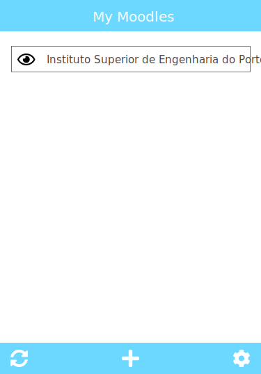
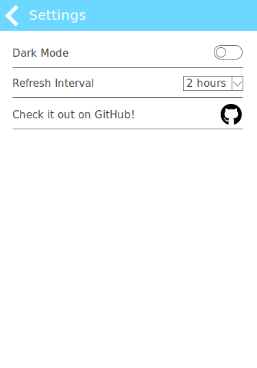
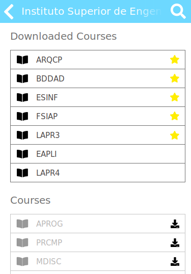
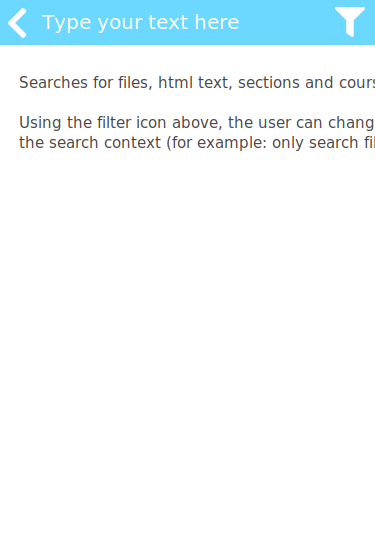
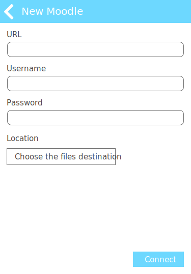
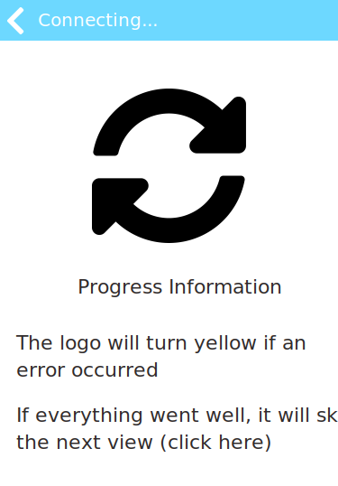
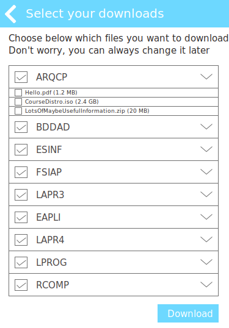
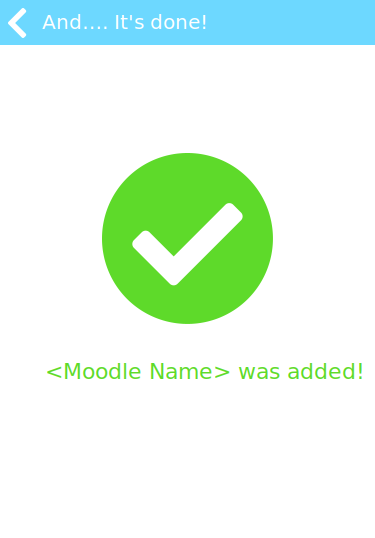

# Noodle
A Moodle Content downloader written in Go.

## Project Description
Noodle is an application that creates a local copy of a Moodle given by the user.
It can also download all the content files available, as well as check for changes
and warn the user about them.

The user has full control over what is downloaded, and how often should the app 
check for updates.

This application stays active in the notification tray. When pressing its icon, 
a small window will appear allowing the user to update all Moodles, check a local
copy of a Moodle, find files, edit the app settings, etc (see [Mockups](#mockups)).

## Goals

Here are the main goals this project aims to achieve. Some other goals might be 
added later, but these are the ones I aim to complete for now:

- [ ] Check for changes each x hours (or any other unit of time)
- [ ] Register a new Moodle
- [ ] Manage which files are downloaded and how often should changes be checked
- [ ] Provide a UI and system tray support

## Mockups

Here are a few Mockups on how the project should look and behave in the end. The
mockup file was created with Adobe XD, and can be found in the `mockups` folder.

Main page | Settings | Moodle View | Course View | Search View
:--------:|:--------:|:-----------:|:-----------:|:-----------:
 |  |  |  | 

### Register Moodle Flow

1 | 2 | 3 | 4 | 5
:--------:|:--------:|:-----------:|:-----------:|:-----------:
 |  |  |  | 

## The stack

This project is being developed in Golang, since it has to constantly run in the 
background and only displays a UI when requested. In order to store the 
information, a SQLite DB is used.

For the UI it will likely use Ultralight for the rendering and Preact + Bootstrap
for the components.

## Contributing

Idk :P If you want to help out with a planned feature or have a suggestion feel 
free to create a Pull Request.

## License

[MIT](https://choosealicense.com/licenses/mit/)