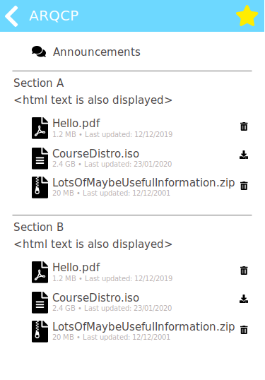

# Noodle
A Moodle Content downloader written in Go.

## Project Description
Noodle is an application that creates a local copy of a Moodle given by the user.
It can also download all the content files available, as well as check for changes
and warn the user about them.

The user has full control over what is downloaded, and how often should the app 
check for updates.

This application stays active in the notification tray. When pressing its icon, 
a small window will appear allowing the user to update all Moodles, check a local
copy of a Moodle, find files, edit the app settings, etc (see [Mockups](#mockups)).

## Goals

Here are the main goals this project aims to achieve. Some other goals might be 
added later, but these are the ones I aim to complete for now:

- [ ] Check for changes each x hours (or any other unit of time)
- [ ] Register a new Moodle
- [ ] Manage which files are downloaded and how often should changes be checked
- [ ] Provide a UI and system tray support

## Mockups

Here are a few Mockups on how the project should look and behave in the end. The
mockup file was created with Adobe XD, and can be found in the `mockups` folder.

Main page | Settings | Moodle View | Course View | Search View
:--------:|:--------:|:-----------:|:-----------:|:-----------:
 |  |  |  | 

### Register Moodle Flow

1 | 2 | 3 | 4 | 5
:--------:|:--------:|:-----------:|:-----------:|:-----------:
 |  |  |  | 

## The stack

This project is being developed in Golang, since it has to constantly run in the 
background and only displays a UI when requested. In order to store the 
information, a SQLite DB is used.

For the UI it will likely use Ultralight for the rendering and Preact + Bootstrap
for the components.

## Contributing

Idk :P If you want to help out with a planned feature or have a suggestion feel 
free to create a Pull Request.

## Instructions

In order to properly run the project use the script: `run-<your platform of choice>`.
This script is responsible for creating the `assets.go` file, which stores all 
the needed files for the application execution. (So far I've only tested on 
Windows, I'll try to check if it works on other platforms asap).

If for some reason you are not using the script and want to build for Windows,
guarantee that the output directory has a file named: `<output>.exe.manifest`,
since *systray* requires this file in order to properly run on Windows.

## Roadmap and necessary future changes

- I'm currently using a fork of `getlantern/systray`, since it's pretty 
unintuitive having to right click on Windows to get the desired action. However 
this fork is not up-to-date with the `getlantern` one.

- I'm also currently using `zserge/lorca` which is pretty neat. However I do 
which to move to `zserge/webview` since *lorca* requires the user to install 
Chrome in order to work. As of the writting of this README, only [~69%](https://gs.statcounter.com/browser-market-share/desktop/worldwide)
of web users use Chrome, while *webview* would allow all users to use the app 
out-of-the-box.

## Author

* **Luís Pinto** - [LiTO773](https://github.com/LiTO773)

## Special thanks
 - [**Twemoji**](https://twemoji.twitter.com/) for the folder icon I'm currently using to test the systray
 - [**Loading.io**](https://loading.io/css/) for the placeholder loading css
 - [**FontAwesome**](https://fontawesome.com/) for the amazing icons

## License

This project is licensed under the [MIT](https://choosealicense.com/licenses/mit/) License.
